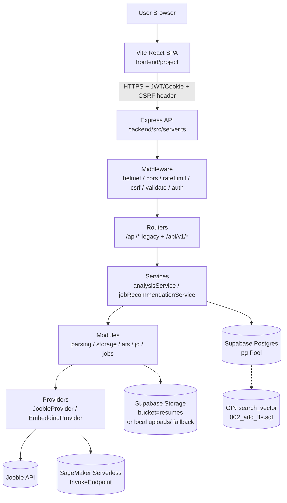
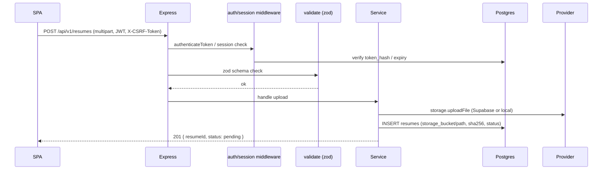
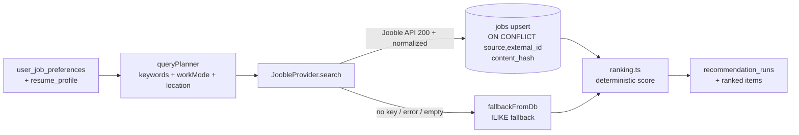

# Architecture — JobHunter V2

## 1. Overview

JobHunter V2 is a resume-driven job recommendation platform. A user uploads a PDF resume → backend extracts text, builds a normalized skill/role profile, stores the file in Supabase Storage, embeds the profile (AWS SageMaker serverless or local fallback), queries Jooble for candidate jobs, ranks/sorts with deterministic scoring, and returns ATS-style analysis plus ranked recommendations. Frontend is a Vite + React SPA served as a static site; backend is an Express + TypeScript API with Postgres (Supabase) persistence.

**Stack:** React 18 + Vite 5 + Tailwind, Express 4 + TypeScript 5, `pg` + Supabase Postgres, Supabase Storage, AWS SageMaker Serverless (embeddings), Jooble API, JWT + httpOnly session cookie, `zod` validation, `helmet`/`cors`/`express-rate-limit`.

## 2. System Components

| Component | Path | Responsibility |
|---|---|---|
| Frontend SPA | `frontend/project` | Auth, resume upload, ATS dashboard, job browsing, preferences |
| API server | `backend/src/server.ts` | Express app, middleware chain, route mounting, health checks |
| Config & env | `backend/src/config/env.ts` | Zod-validated env, `getDatabaseUrl()`, `getCorsOrigins()` |
| DB pool | `backend/src/config/database.ts` | `pg.Pool` with Supabase SSL |
| Routes — legacy | `backend/src/routes/{auth,upload,analysis,jobs}.ts` | Backward-compat `/api/*` |
| Routes — V1 | `backend/src/routes/v1/*` | Spec-compliant `/api/v1/*`: `auth`, `resumes`, `analyses`, `profile`, `recommendations` |
| Middleware | `backend/src/middleware/{auth,csrf,validate}.ts` | JWT auth, CSRF double-submit + Origin check, Zod body validation |
| Modules — auth | `backend/src/modules/auth/session.ts` | Session create/verify/revoke, token_hash, expiry |
| Modules — parsing | `backend/src/modules/parsing/{pdfParser,resumeProfile,skillNormalizer}.ts` | PDF → text → normalized profile |
| Modules — storage | `backend/src/modules/storage/supabaseStorage.ts` | `uploadFile`/`downloadFile`/`deleteFile` (Supabase private bucket or local fallback) |
| Modules — JD | `backend/src/modules/jd/{jdParser,matcher}.ts` | JD parse + keyword/semantic matcher |
| Modules — jobs | `backend/src/modules/jobs/{queryPlanner,ranking}.ts` | Query planning + deterministic ranking |
| Modules — ATS | `backend/src/modules/ats/readinessScorer.ts` | ATS readiness score |
| Providers — jobs | `backend/src/providers/jobs/{JobProvider,JoobleProvider}.ts` | `JobProvider` interface + Jooble (+ DB fallback + `storeToDb`) |
| Providers — embeddings | `backend/src/providers/embeddings/*` | `EmbeddingProvider` interface; `AwsSageMakerEmbeddingProvider` (with `MockEmbeddingProvider` fallback), `MockEmbeddingProvider` |
| Services | `backend/src/services/{analysisService,jobRecommendationService,joobleService}.ts` | Orchestration (analysis pipeline, recommendation run persistence) |
| Migrations | `backend/migrations/*.sql` | `001_initial_v2`, `002_add_fts`, `003_storage_metadata` (idempotent) |
| Python shim | `backend/python/*` | Local `pdf_text_extract.py` / `resume_analyzer_ml.py` shim when SageMaker not configured |

## 3. High-Level Diagram



## 4. Request Lifecycle



## 5. Data Flows

### 5.1 Resume Upload & Storage

1. Client sends `multipart/form-data` with `Authorization: Bearer <JWT>` and (if `SameSite=None`) `X-CSRF-Token` matching `csrf_token` cookie.
2. `multer` (memory) validates `application/pdf`, size limits.
3. `supabaseStorage.uploadFile(userId, resumeId, buffer, filename)`:
   - Computes `sha256`; sanitizes filename; builds `objectPath = userId/resumeId/safeName`.
   - If `SUPABASE_URL` + `SUPABASE_SERVICE_ROLE_KEY` present → `@supabase/supabase-js` `storage.from(bucket).upload(path, buffer, {contentType:'application/pdf', upsert:true})`.
   - On error or missing creds → local fallback `uploads/userId/resumeId/file` (dev only, with warning). Returns `{bucket, path, sha256}`.
4. DB row `resumes` stores `storage_bucket`, `storage_object_path`, `sha256`, `file_size_bytes`, `page_count`, `parser_version`, `processing_status`, `is_latest`.
5. Temp files under `uploads/temp/` are ephemeral and not used as primary storage.

### 5.2 PDF Parsing & Profile Extraction

`pdfParser.ts` → text extraction → `resumeProfile.ts` + `skillNormalizer.ts` produce `resume_profile` (skills, roles, seniority) persisted alongside the resume. Failures set `processing_status='failed'`.

### 5.3 ATS & JD Matching

`readinessScorer.ts` computes ATS score; `jdParser.ts` + `matcher.ts` handle JD input and keyword/semantic overlap. Results stored in `analyses` table.

### 5.4 Job Retrieval & Ranking



- `JoobleProvider` POSTs to `https://jooble.org/api/<key>` with `{keywords, location, page}`, timeout 10s; `normalize()` maps Jooble shape → `NormalizedJob`; `storeToDb()` upserts with `content_hash`.
- Budget caps: `JOOBLE_MAX_QUERIES_PER_REFRESH` (default 4), `JOOBLE_CALL_BUDGET` (default 450) enforced in service layer.

### 5.5 Embeddings — ML Invocation

`AwsSageMakerEmbeddingProvider` implements `EmbeddingProvider`:

- `embed({texts, purpose})`: truncates to 5000 chars, batches >32 texts, calls `MockEmbeddingProvider` if `AWS_*` creds absent.
- With creds: lazy-imports `@aws-sdk/client-sagemaker-runtime`, invokes `InvokeEndpoint` with `EndpointName`, `ContentType: application/json`, `Body: {inputs: texts, purpose}`, 15s timeout; expects `{embeddings|vectors: number[][]}`.
- Any SDK error / bad shape / timeout → warn + fallback to mock (deterministic hash-based vectors, dim 384). `modelId = EMBEDDING_MODEL_ID`.

Caching: embeddings for resume/job texts may be memoized per analysis run; vector storage is not required for MVP (ranking is keyword-first, embeddings are an augmentation).

## 6. Trust Boundaries

| Boundary | Controls |
|---|---|
| Browser ↔ API | CORS allowlist (`CORS_ALLOWED_ORIGINS` / `FRONTEND_URL`), `helmet`, `credentials:true`, `express-rate-limit` on `/api/auth` (20/15m) and uploads (10/min) |
| Auth | JWT Bearer + `sessions.token_hash`; ownership checks on every resource (IDOR guard) |
| Upload | `multer` mime/size filter, `sha256`, filename sanitization, Supabase private bucket (service-role only) |
| External calls | Jooble key server-side only; SageMaker creds server-side only; timeouts + fallbacks |
| DB | `pg` parameterized queries, RLS-ready schema, SSL required for Supabase |

## 7. Storage Flow (Supabase)

```
Client → API (validated) → supabaseStorage.uploadFile() → Supabase Storage (private bucket `resumes`) → DB `resumes.storage_*` ref
Read:  API (owner check) → supabaseStorage.downloadFile(ref) → Supabase download (Blob → Buffer)
Delete: API (owner check) → supabaseStorage.deleteFile(ref) → Supabase remove() + DB flag
```

Bucket is **private**; no public URLs are issued. Signed URLs, if added later, must be short-lived and owner-checked.

## 8. Authentication & Session

- `POST /api/v1/auth/signup|login` returns JWT; JWT stored client-side (and/or httpOnly cookie `jobhunter_session`).
- `sessions` table stores `token_hash` (sha256 of token), `expires_at`, `last_used_at`, `revoked_at`.
- `authenticateToken` reads `Authorization: Bearer <token>`, verifies with `JWT_SECRET`, attaches `req.user`.
- Session TTL default 7 days (`SESSION_TTL_DAYS`), configurable.

## 9. Caching & Versioning

- No shared cache yet (Redis optional future).
- Per-provider in-process memo for embeddings within a request.
- `parser_version` column on `resumes`; `modelId` on embedding responses — both persisted to allow re-computation tracking.
- `/health` and `/api/v1/health` expose `{status, timestamp, uptime}` / `{success, status, version}`.

## 10. Privacy

- PII limited to `users.email`, `display_name`, resume PDF + extracted profile. No resume content is sent to third parties except Jooble (keywords only, no PII) and SageMaker (embedding inputs — resume/job text slices).
- `sha256` enables dedup without retaining duplicate bytes.
- Deletion: `DELETE /api/v1/resumes/:id` removes Storage object + DB row (owner-checked); user deletion cascades via FKs.

## 11. Versioning & Migrations

- Migrations are idempotent, versioned SQL under `backend/migrations/` applied via `npm run migrate` (`src/db/migrations/run_migration.ts`).
- `001_initial_v2` — core tables (`users`, `sessions`, `user_job_preferences`, `resumes`, `jobs`, `analyses`, `recommendation_runs`, etc.) with `pgcrypto` UUIDs.
- `002_add_fts` — weighted `search_vector` + GIN index + `is_latest` partial unique index.
- `003_storage_metadata` — Supabase `storage_bucket/path`, `sha256`, `file_size_bytes`, `page_count`, `parser_version` backfills.
