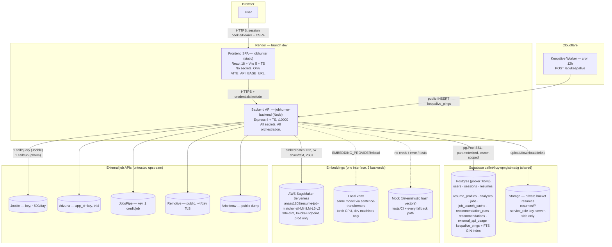

# JobHunter — System Architecture & Data Flow

Branch: `dev` · Last verified: 2026-10-02 (code-read + live local/Render sweep).
Companion docs: `README.md` (reference), `LOCAL_SETUP.md` (run it),
`SECURITY.md`, `DEPLOYMENT.md`, `KEEPALIVE.md`.

> One-line model: **deterministic document scoring + strict skill matching run
> free on Render; the single ML primitive (`texts[] → vectors[]`) runs on
> SageMaker Serverless in prod and a local venv on dev machines; jobs come
> from 5 external APIs, get cached/deduped in Postgres, and are re-ranked by
> the same rubric + embeddings.**

---

## 1. System context


```mermaid
flowchart TB
  subgraph Browser
    U[User]
  end
  subgraph Render["Render — branch dev"]
    FE["Frontend SPA — jobhunter (static)\nReact 18 + Vite 5 + TS\nNo secrets. Only VITE_API_BASE_URL."]
    API["Backend API — jobhunter-backend (Node)\nExpress 4 + TS, :10000\nAll secrets. All orchestration."]
  end
  subgraph Supabase["Supabase vaflmkhzyvqmglstmadg (shared)"]
    DB[("Postgres (pooler :6543)\nusers · sessions · resumes ·\nresume_profiles · analyses · jobs ·\njob_search_cache · recommendation_runs ·\nrecommendations · external_api_usage ·\nkeepalive_pings + FTS GIN index")]
    STO[("Storage — private bucket resumes\nresumes/<userId>/<resumeId>/<file>\nservice_role key, server-side only")]
  end
  subgraph ML["Embeddings (one interface, 3 backends)"]
    SM[("AWS SageMaker Serverless\nanass1209/resume-job-matcher-all-MiniLM-L6-v2\n384-dim, InvokeEndpoint, prod only")]
    LV[("Local venv\nsame model via sentence-transformers\ntorch CPU, dev machines only")]
    MK[("Mock (deterministic hash vectors)\ntests/CI + every fallback path")]
  end
  subgraph Jobs["External job APIs (untrusted upstream)"]
    J1[(Jooble — key, ~500/day)]
    J2[(Adzuna — app_id+key, trial)]
    J3[(JobsPipe — key, 1 credit/job)]
    J4[(Remotive — public, ~4/day ToS)]
    J5[(Arbeitnow — public dump)]
  end
  subgraph CF["Cloudflare"]
    KW["Keepalive Worker — cron 12h\nPOST /api/keepalive"]
  end

  U -->|"HTTPS, session cookie/Bearer + CSRF"| FE
  FE -->|"HTTPS + credentials:include"| API
  API -->|"pg.Pool SSL, parameterized, owner-scoped"| DB
  API -->|"upload/download/delete"| STO
  API -->|"embed batch ≤32, 5k chars/text, 260s"| SM
  API -.->|"EMBEDDING_PROVIDER=local"| LV
  API -.->|"no creds / error / tests"| MK
  API -->|"1 call/query (Jooble)\n1 call/run (others)"| J1
  API --> J2 & J3 & J4 & J5
  KW -->|"public INSERT keepalive_pings"| API
```

**Trust boundaries.** The browser never touches Supabase, AWS, or job APIs —
every external call is server-side so secrets stay secret. Supabase is the
system of record (relational data + private PDFs). SageMaker is a pure
function with no storage. Job APIs are untrusted input: normalized, cached,
deduped, re-ranked before display. PII (email/phone/PDF bytes) never leaves
for AWS — only redacted professional chunks (skills line, title/description
slices).

---

## 2. Component map (exact paths)

| Layer | Path | Responsibility |
|---|---|---|
| Entrypoint | `backend/src/server.ts` | helmet/cors/cookies/rate-limits, mounts `/keepalive`, `/api/*` legacy, `/api/v1/*`, `/health` |
| Env | `backend/src/config/env.ts` | zod validation (fails closed in prod), `getDatabaseUrl()`, `getCorsOrigins()` |
| DB pool | `backend/src/config/database.ts` | `pg.Pool`, Supabase SSL |
| V1 routes | `backend/src/routes/v1/{auth,resumes,analyses,profile,recommendations,index}.ts` | Live `/api/v1/*` API |
| Legacy routes | `backend/src/routes/{auth,upload,analysis,jobs}.ts` | Deprecated `/api/*` compat |
| Keepalive | `backend/src/routes/keepalive.ts` | Public ping endpoints, `keepalive_pings` insert + prune |
| Middleware | `backend/src/middleware/{auth,csrf,validate}.ts` | Opaque-session-first auth (+JWT fallback), Origin + double-submit CSRF, zod validation |
| Auth | `backend/src/modules/auth/session.ts` | Sessions: `token_hash = sha256(token)`, 7-day TTL, `revoked_at` |
| Parsing | `backend/src/modules/parsing/{pdfParser,resumeProfile,skillNormalizer}.ts` | PDF → text → profile; `CANONICAL_SKILL_ALIASES` is the single skill vocabulary shared by resume, JD, and ranking |
| Storage | `backend/src/modules/storage/supabaseStorage.ts` | Private-bucket upload/download/delete; local `uploads/` fallback in dev only |
| ATS | `backend/src/modules/ats/readinessScorer.ts` (v3.0.0) | 100-pt deterministic rubric, zero network |
| JD | `backend/src/modules/jd/{jdParser,matcher}.ts` | JD structure + strict set-equality skill match (`Java != JavaScript`) + display-only family hints |
| Jobs | `backend/src/modules/jobs/{queryPlanner,ranking}.ts` | 3–4 focused queries; `rankJobsBatch` (v2.0.0) |
| Job providers | `backend/src/providers/jobs/{JobProvider,Jooble,Adzuna,JobsPipe,Remotive,Arbeitnow,jobStore,providerBudgets}.ts` | One interface, 5 sources, shared upsert, quota guards |
| Embedding providers | `backend/src/providers/embeddings/{EmbeddingProvider,AwsSageMaker,Local,Mock}.ts` | One interface; truthful `modelId` (`mock-*` on fallback) so logs/DB never lie |
| Migrations | `backend/migrations/001–005.sql` | Idempotent schema (`npm run migrate`) |

Gate chain on every state-changing request: **CORS allowlist → helmet → auth
→ CSRF → rate limit (auth 20/15 min, upload 10/min) → zod → owner check
(`user_id`, 403 on mismatch)**. Handlers orchestrate; math lives in pure
modules (unit-testable without DB/network).

---

## 3. Data flows

### 3.1 Upload & store — `POST /api/v1/resumes`

```
Browser --multipart resume.pdf + targetLevel--> multer (memory, PDF-only, 5 MB)
  --> parsePdfBuffer (%PDF magic, pdfjs positional → pdf-parse → raw fallback,
      >8 pages guarded, extractionConfidence, SCANNED_PDF 400 on image PDFs)
  --> supabaseStorage.uploadFile → resumes/<userId>/<resumeId>/<safeName>
  --> resumes row (bucket, path, sha256, size, pages, parser 3.0.0, is_latest)
  --> 201 {resumeId}
```

### 3.2 Readiness (no JD, zero ML) — `POST /api/v1/analyses/readiness`

```
profile (resume_profiles, else re-parse) --> scoreReadiness() --> 8 categories = 100
  20 parseability · 15 completeness · 20 impact/evidence · 15 experience/project ·
  10 skills clarity · 10 writing · 5 concision · 5 hygiene
  + strictness (-4 no summary, -5 single job, -10 none, -3 unquantified, cap 75 if thin)
--> analyses row (type=readiness) --> {score, breakdown, rules, strengths,
    warnings, priorityActions, metrics}
```

### 3.3 JD match (JD + ML) — `POST /api/v1/analyses/jd-match`

```
profile + parseJd(title [Reporting-To ignored], seniority, required/preferred
  split at preferred-vs-required headings, ≤10 responsibilities [headings and
  Reporting-To:/Experience:/Location: lines filtered], years, domain)
  + matchJd (required×70 + preferred×30, family hints display-only)
  + redacted chunks (resume: skills line + ≤5 exp slices ≤500 chars;
                     JD: title + ≤10 resps ≤400 chars + ≤10 skills)
  --> ONE provider.embed({uniqTexts, purpose:'jd'})   <-- the only AWS call
  --> cosine per responsibility vs BEST resume chunk --> semantic = round(avg×30)
  --> jdScore = min(100, requiredCoverage×35 + semantic + role 15/5 + domain 5 + edu 10/8/2)
  --> confidence (High: JD>1000 chars & ≥3 skills; Low: <300; else Medium)
  --> analyses row (type=jd_match, jd_hash, embedding_model_id)
```

Embed failure never 500s — returns degraded JSON with readiness intact.

### 3.4 Recommendations (jobs + ML) — `POST /api/v1/recommendation-runs`

```
profile + preferences(targetRoles/locations/workModes)
  --> queryPlanner.plan() → 3–4 queries, never skills.join(' '):
      role alone · Junior <role> (juniors) · role+toolSkill · Fresher <skill>
      (academic noise like DSA/DBMS excluded as search terms)
  --> Jooble: 1 call per query (≤4) ─┐
  --> JobsPipe/Adzuna/Remotive/Arbeitnow: 1 call each on primary query
      (JobsPipe adds seniority filter for juniors; Arbeitnow filtered locally) ├─ merge
  --> job_search_cache (sha256 key, 1 h TTL, 12 h Arbeitnow, shared users)
  --> jobs upsert ON CONFLICT (source, external_id)
  --> dedupe: url|source|id, then title|company collapse across providers
  --> rankJobsBatch: ONE provider instance, ONE embed of all unique texts
      (ceil(n/32) sequential invokes — the old per-job fan-out throttled the
      MaxConcurrency=1 endpoint into all-mock)
  --> per job: skill 30 (≤2 signals → neutral 15) + semantic 25 (best-chunk,
      to01-stretched cosine) + title 15 + seniority 15 (roman numerals, Sr/Jr,
      L-bands, N+ years; junior-vs-senior/lead HARD-CAPPED at 65) +
      domain/edu 10 + location 5 (India-city containment, remote-anywhere)
  --> sort desc, top 20 --> recommendation_runs + recommendations rows
  --> {runId, totalFetched, deduped, sources{per-provider counts},
       recommendations[20 with matchedSkills/missingSkills], versions}
```

Quota guards (`providerBudgets.ts` over `external_api_usage`): Adzuna
100/day, Remotive 4/day (their ToS), JobsPipe 1000 credits/month, Jooble
450/day legacy counter. Exhaustion → silent DB-cache fallback, never an error.

---

## 4. Scoring contracts (exact, code-is-truth)

- **Readiness:** `readinessScorer.ts`, weights sum exactly 100 (constructor
  throws otherwise); rule status pass ≥85% / warn ≥45%; labels ≥90 Excellent ·
  ≥80 Strong · ≥70 Competitive · ≥55 Needs work · else High risk.
- **JD match:** `explicitPts = round(requiredCoverage×35)`; semantic from
  best-chunk cosine; role 15 if a profile skill appears in the JD title else 5;
  domain 5 flat; edu 10/8/2.
- **Ranking:** `30+25+15+15+10+5 = 100`; cosine stretched
  `to01 = clamp((c−0.35)/0.6)` because raw embedding cosines cluster 0.4–0.8;
  semantic uses max-over-chunks (a single summary vector ranks noise);
  `detectJobSeniority` understands II/III/IV, Sr./Jr., L3–L6, `N+ years`,
  `1+ years`→junior, bare `Associate Engineer`→junior.
- **Confidence:** recommendation runs High ≥70 / Medium ≥40; frontend shows
  top-20 with min-fit filter (default 40%).

---

## 5. Deployment topology & failure modes

| Piece | Prod | Local | If it fails |
|---|---|---|---|
| SPA | Render static `jobhunter` | `vite dev :5173` | — |
| API | Render Node `jobhunter-backend` (`NODE_VERSION 20.11.0`, `:10000`, free-tier sleep) | `node dist/server.js :3001` | cold start 30–60 s; health `/health` |
| DB/Storage | Supabase (shared by both) | same Supabase | keepalive worker pings 12 h; local `uploads/` fallback if no creds |
| Embeddings | SageMaker Serverless, 260 s timeout | venv, 260 s spawn timeout | truthful `mock-*` fallback + warn log; app never 500s |
| Jobs | 5 live APIs + cache + budgets | same | DB-cache fallback; empty pool → `Medium/Low` confidence, still renders |

Known limits: Jooble India skews senior (ranker demotes, JobsPipe/Adzuna
counterweight); thin snippets score neutral by design; title-overlap is weak
for interns (15 pts mostly dormant); no OCR (scanned PDFs rejected with
guidance); free tiers sleep/pause (keepalive mitigates Supabase only).

---

## 6. Verification (how this doc was checked)

Every behavioral claim above was verified 2026-10-02 by code-reading
(`backend/src/**`, `frontend/project/src/**`, migrations, `render.yaml`,
`ci.yml`) plus a live sweep: Render public endpoints + full authed flow
(signup → upload → readiness **58** → jd-match **60**/Medium/real embeddings
→ 5-provider run, top = intern/entry roles) and the identical flow locally
(readiness **58**, jd-match **60**, `usedMock: false`, byte-identical
Supabase download). Numbers, timeouts, budgets, and SQL shapes were read from
source, not memory — re-check them the same way before trusting this file
after any refactor.
