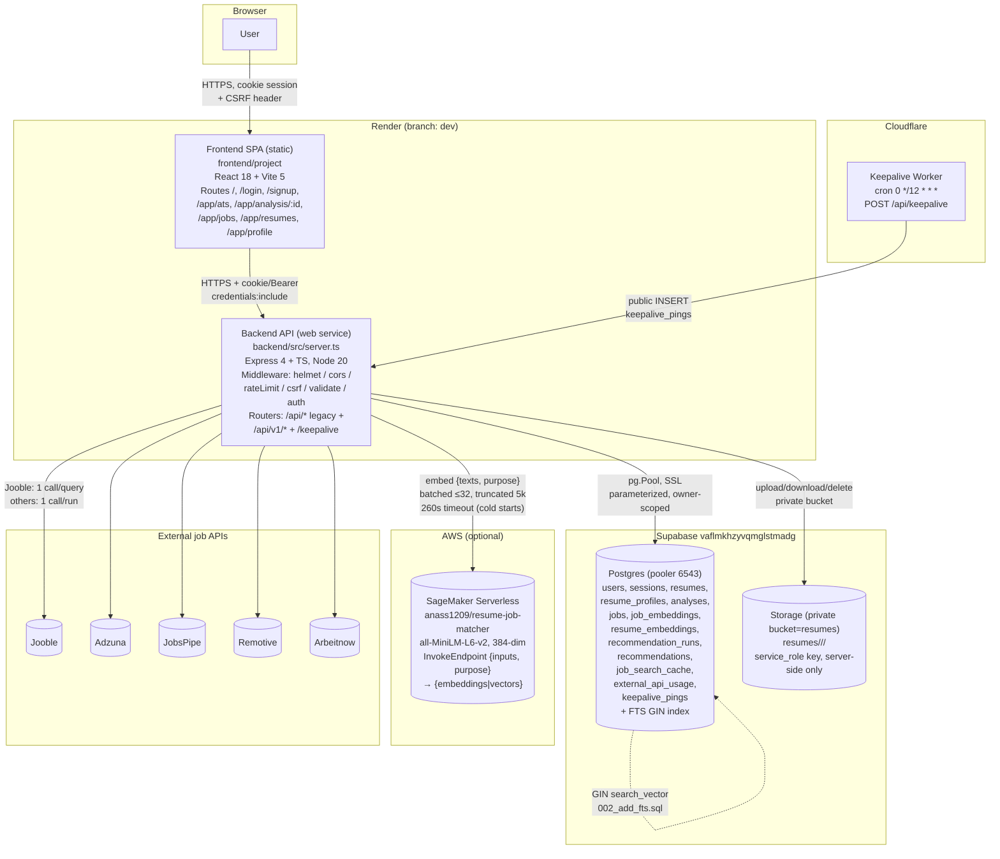
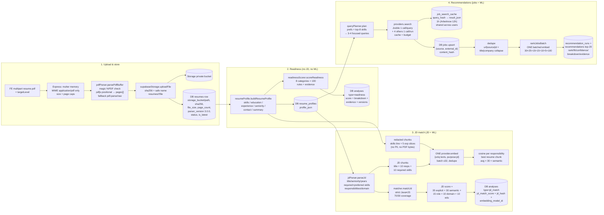

# JobHunter V2 — Resume ATS + JD Match + Job Recommendations

> **Working branch: `dev`.** All active development, Render auto-deploys, and CI run off `dev`.
> `master` is the preserved legacy/prod branch. `main` exists as a remote alias — do not use it as the working branch.

Portfolio-ready, production-hardened rebuild of JobHunter: **deterministic ATS readiness (no ML)**,
**chunked semantic JD matching via AWS SageMaker Serverless**, **controlled multi-provider job retrieval and ranking**,
**private Supabase storage**, and **secure opaque sessions**.

- **Resume Readiness (no JD):** 100-point deterministic rubric. Zero embeddings, zero AWS calls. Versioned (`3.0.0`), rule IDs + evidence.
- **JD Match (with JD):** readiness + structured JD parsing + strict canonical skill matching (`Java != JavaScript`) + redacted professional-chunk embeddings + responsibility-level semantic coverage. Returns `JD Match 0–100` + breakdown + missing requirements + evidence + `High/Medium/Low` confidence.
- **Job Recommendations:** preferences → focused query planner (3–4 queries) → cached multi-provider search (Jooble + Adzuna + JobsPipe + Remotive + Arbeitnow) + persistent `external_api_usage` budget → dedupe → deterministic filters → batched semantic ranking (`30+25+15+15+10+5 = 100`) → top 20 with evidence. Separate from the ATS flow.
- **Privacy:** PDF lives in Supabase **private** bucket `resumes/<userId>/<resumeId>/<file>`. PII (email/phone) is never sent to AWS — only redacted professional chunks (skills, titles, sliced descriptions). Owner-scoped queries everywhere.

---

## Table of contents

1. [Branches](#1-branches)
2. [What is deployed where](#2-what-is-deployed-where)
3. [Architecture](#3-architecture)
4. [How things work (request lifecycle)](#4-how-things-work-request-lifecycle)
5. [Data flow (end to end)](#5-data-flow-end-to-end)
6. [Where calculations happen](#6-where-calculations-happen)
7. [Database](#7-database)
8. [API reference](#8-api-reference)
9. [Frontend](#9-frontend)
10. [Embeddings / ML invocation](#10-embeddings--ml-invocation)
11. [Job providers](#11-job-providers)
12. [Keepalive (Supabase anti-pause)](#12-keepalive-supabase-anti-pause)
13. [Security model](#13-security-model)
14. [Local development](#14-local-development)
15. [Environment variables](#15-environment-variables)
16. [Testing & evaluation](#16-testing--evaluation)
17. [CI](#17-ci)
18. [Limitations](#18-limitations)
19. [Related docs](#19-related-docs)

---

## 1. Branches

| Branch | Role |
|---|---|
| `dev` | **Main working branch.** All feature work lands here. Render Blueprint (`render.yaml:20,108`) tracks `branch: dev` for both services. CI (`ci.yml`) runs on `dev` + `master`. |
| `master` | Legacy / prod snapshot. Preserved, not the working branch. |
| `main` (remote alias) | Exists on origin only. Not used. |

```bash
git checkout dev
git pull origin dev
# feature work → PR / push → origin dev → Render auto-deploys
```

Remote: `git@github.com:Vinay-003/jobhunter_.git`.

---

## 2. What is deployed where

| Piece | Host | Config | Notes |
|---|---|---|---|
| **Frontend SPA** (`frontend/project`) | **Render Static Site** `jobhunter` | `rootDir: frontend/project`, build `npm ci --include=dev && npm run build`, publish `dist`, SPA rewrite `/* → /index.html`, `branch: dev` | Example URL: `https://jobhunter-r773.onrender.com`. `VITE_*` vars are **build-time** — changing them requires a rebuild. |
| **Backend API** (`backend`) | **Render Web Service** `jobhunter-backend` | `region: oregon`, `plan: free`, `rootDir: backend`, build `npm ci --include=dev && npm run build` (`tsc → dist/`), start `node dist/server.js`, health `/health`, `branch: dev`, `NODE_VERSION 20.11.0`, `PORT 10000` | Example URL: `https://jobhunter-backend-lkkf.onrender.com`. Free tier sleeps → cold starts. All secrets `sync: false` (dashboard-only, never committed). |
| **Postgres + Storage** | **Supabase** (project `vaflmkhzyvqmglstmadg`) | Pooler `aws-0-ap-southeast-1.pooler.supabase.com:6543?pgbouncer=true`, `PG_SSL=true`, private bucket `resumes` | Migrations `001–005` idempotent. Accessed via `pg.Pool` + `service_role` key **server-side only**. |
| **Embeddings (ML)** | **AWS SageMaker Serverless** | Model `anass1209/resume-job-matcher-all-MiniLM-L6-v2` (384-dim), endpoint e.g. `jobhunter-anass-serverless`, `MemorySizeInMB 2048–4096`, `MaxConcurrency 1–5`, scale-to-zero | Called via `InvokeEndpoint` only. Least-privilege IAM (`sagemaker:InvokeEndpoint` on the one endpoint ARN). **Optional** — without creds the backend uses a deterministic mock so every flow still works. |
| **Jobs (external APIs)** | **Jooble, Adzuna, JobsPipe, Remotive, Arbeitnow** (third-party SaaS, not self-hosted) | Keys server-side only; budgets enforced in `external_api_usage`; results cached in `job_search_cache` + `jobs` | Jooble `POST https://jooble.org/api/<key>`; others one call per run on the primary query. Fallback to DB cache when keys missing / quota hit / empty. |
| **Keepalive cron** | **Cloudflare Worker** `jobhunter-supabase-keepalive.vinayjadam2003.workers.dev` | Cron `0 */12 * * *` (every 12h) → `POST <backend>/api/keepalive` | Cheap `INSERT` into `keepalive_pings` to reset Supabase's 7-day inactivity pause timer. Worker code in `workers/keepalive-worker/`, deployed via dashboard (not from git). |
| **CI** | **GitHub Actions** (`.github/workflows/ci.yml`) | On push/PR to `dev`, `master` | Frontend lint/typecheck/build; backend lint/typecheck/`bun test`/build; `npm audit` + gitleaks secret scan. |

Cost rule used throughout: **`needs ML? NO → Render, YES → SageMaker (batched + deduped + cached)`**.
Render does all deterministic work for free; AWS bills per embedding invocation + duration, so every ML path batches (≤32 texts), dedupes by content hash, caches (`job_search_cache`, per-run vectors), and falls back to mock instead of failing.

---

## 3. Architecture

### 3.1 System diagram



**Explanation.** The browser never talks to Supabase, AWS, or job APIs directly — every external call is made
server-side by the Express backend so secrets stay secret. Render hosts two things from the same `dev` branch:
a static SPA (no secrets, only `VITE_API_BASE_URL`) and a stateful API (all secrets, all orchestration).
Supabase is the system of record (relational data + private PDFs). SageMaker is a pure function
`texts[] → vectors[]` with no storage of its own. Job APIs are untrusted upstream sources whose results are
normalized, cached, deduped, and re-ranked before ever reaching the user. The Cloudflare Worker exists only to
keep the free-tier Supabase project warm.

### 3.2 Backend module map (exact paths)

| Layer | Path | Responsibility |
|---|---|---|
| Entrypoint | `backend/src/server.ts` | Express app, helmet/cors/cookies/rate-limits, mounts `/keepalive`, `/api/*` legacy, `/api/v1`, `/health`, 404 + error handler |
| Env | `backend/src/config/env.ts` | `zod` validation, `getDatabaseUrl()` (priority `PG_DATABASE_STRING > DATABASE_URL > SUPABASE_DB_URL`), `getCorsOrigins()`; fails closed in prod |
| DB pool | `backend/src/config/database.ts` | `pg.Pool` with Supabase SSL |
| V1 routes | `backend/src/routes/v1/{auth,resumes,analyses,profile,recommendations,index}.ts` | Spec `/api/v1/*` |
| Legacy routes | `backend/src/routes/{auth,upload,analysis,jobs}.ts` | Backward-compat `/api/*` (deprecated) |
| Keepalive | `backend/src/routes/keepalive.ts` | Public `GET/POST/PUT /` + `/ping` + `/health`; INSERT + prune `keepalive_pings` |
| Middleware | `backend/src/middleware/{auth,csrf,validate}.ts` | Session/JWT auth, Origin + double-submit CSRF, `zod` body validation |
| Auth module | `backend/src/modules/auth/session.ts` | Opaque session create/verify/revoke (`token_hash = sha256(token)`, expiry) |
| Parsing | `backend/src/modules/parsing/{pdfParser,resumeProfile,skillNormalizer}.ts` | PDF → text → normalized profile (skills/roles/seniority) |
| Storage | `backend/src/modules/storage/supabaseStorage.ts` | `uploadFile`/`downloadFile`/`deleteFile` (Supabase private bucket or local `uploads/` fallback) |
| ATS | `backend/src/modules/ats/readinessScorer.ts` | Deterministic readiness score (v3.0.0, no ML) |
| JD | `backend/src/modules/jd/{jdParser,matcher}.ts` | JD structure parse + strict keyword match |
| Jobs | `backend/src/modules/jobs/{queryPlanner,ranking}.ts` | 3–4 focused queries + deterministic + semantic ranking (v2.0.0) |
| Job providers | `backend/src/providers/jobs/{JobProvider,JoobleProvider,AdzunaProvider,JobsPipeProvider,RemotiveProvider,ArbeitnowProvider,jobStore,providerBudgets}.ts` | `JobProvider` interface + 5 sources + upsert + budgets |
| Embedding providers | `backend/src/providers/embeddings/{EmbeddingProvider,AwsSageMakerEmbeddingProvider,LocalEmbeddingProvider,MockEmbeddingProvider}.ts` | `EmbeddingProvider` interface; SageMaker (prod) / local venv (dev) / mock (tests + fallback) |
| Services | `backend/src/services/{jobRecommendationService,joobleService,analysisService}.ts` | Legacy orchestration shims (V2 logic lives in the v1 routes + modules above) |
| Migrations | `backend/migrations/001–005.sql` + `backend/src/db/migrations/run_migration.ts` | Idempotent versioned schema, applied via `npm run migrate` |
| Python shim | `backend/python/` | Legacy local ML shim (V2 uses Node providers instead) |

---

## 4. How things work (request lifecycle)

```mermaid
sequenceDiagram
  participant FE as SPA (lib/api.ts)
  participant API as Express (server.ts)
  participant Auth as auth/session + csrf
  participant Val as validate (zod)
  participant Svc as Route handler (v1/*)
  participant MOD as Modules (parsing/ats/jd/jobs)
  participant PROV as Providers (storage/jobs/embeddings)
  participant DB as Supabase Postgres
  participant STO as Supabase Storage
  participant ML as SageMaker Serverless

  FE->>API: HTTPS + cookie jobhunter_session (or Bearer) + X-CSRF-Token
  API->>Auth: Origin check; session verify (token_hash, expiry, revoked_at)
  Auth->>DB: SELECT sessions WHERE token_hash=$1
  API->>Val: zod schema check → 400 on malformed
  Val-->>API: ok
  API->>Svc: handler (owner check: WHERE id=$1 AND user_id=$2)
  Svc->>PROV: storage.uploadFile / provider.search / provider.embed
  PROV->>STO: private bucket resumes/... (resumes only)
  PROV->>ML: InvokeEndpoint {inputs, purpose} (embeddings only)
  Svc->>MOD: parse → profile → score/rank (pure functions)
  Svc->>DB: INSERT resumes / resume_profiles / analyses / jobs / recommendation_runs
  Svc-->>FE: 200/201 JSON { success:true, ... }
```

Every state-changing request passes the same gate chain: **CORS allowlist → helmet → auth (opaque session
first, JWT fallback) → CSRF (Origin + double-submit when a CSRF cookie exists) → rate limit (auth 20/15min,
upload 10/min) → zod validation → owner check (`user_id = req.user.id`, 403 on cross-user access)**.
Handlers are thin orchestrators; all scoring/ranking math lives in pure modules (`readinessScorer`,
`jdParser`/`matcher`, `queryPlanner`/`ranking`) so it is unit-testable without DB or network.

---

## 5. Data flow (end to end)



### 5.1 Resume upload & storage (`routes/v1/resumes.ts` → `pdfParser.ts` → `supabaseStorage.ts`)

1. Client sends `multipart/form-data` (`resume` file + `targetLevel`) with session cookie/Bearer + `X-CSRF-Token`.
2. `multer` (in-memory) enforces `application/pdf` MIME + size limits; filename sanitized
   (`[^a-zA-Z0-9._-]` → `_`, 120 chars) so no directory traversal.
3. `parsePdfBuffer` verifies `%PDF` magic bytes, extracts with **pdfjs-dist positional** (x/y gap detection keeps
   line breaks for bullets/sections), falls back to `pdf-parse` then raw content-stream regex; guards `>8 pages`;
   computes `layoutSignals` (multi-column/table risk), `extractionConfidence` (0.92 pdfjs / 0.84 pdf-parse / 0.5
   fallback minus penalties), flags `detectedAsScanned` (<200 chars from a large binary = 400 `SCANNED_PDF`).
4. `uploadFile(userId, resumeId, buffer, filename)` computes `sha256`, builds
   `objectPath = userId/resumeId/safeName`, uploads to Supabase private bucket `resumes`
   (`contentType: application/pdf`, `upsert: true`) via `service_role` key; on missing creds/error warns and
   writes to local `uploads/<user>/<resume>/` (dev only). Returns `{bucket, path, sha256}`.
5. `resumes` row stores `storage_bucket`, `storage_object_path`, `sha256`, `file_size_bytes`, `page_count`,
   `parser_version`, `processing_status`, `is_latest`. Reads/deletes re-check ownership first; deletes remove the
   Storage object **and** the DB row.

### 5.2 PDF parsing & profile (`modules/parsing/`)

- **`pdfParser.ts`** → `ParsedDocument {pages, normalizedText, sections, layoutSignals, extractionConfidence,
  detectedAsScanned, sha256, charCount}`. Sections detected by short-line canonical headings
  (`experience`, `education`, `skills`, …) plus synonyms (`professional experience → experience`,
  `tech stack → skills`, …); `technical skills`/`project`/`work experience` aliased to canonical keys.
- **`resumeProfile.ts`** → `ResumeProfile {skills, skillsNormalized, education, experience,
  totalExperienceYears, seniority, contactSignals, summary, languages}`. Skills found by longest-first
  word-boundary scan of `CANONICAL_SKILL_ALIASES` (single source of truth shared with JD + ranking, so bare
  `react`/`python`/`html` all resolve the same way). Experience via date-range regex with education-vs-work
  keyword guards + single-year fallback; years from year arithmetic (`new Date().getFullYear()`, never hardcoded);
  seniority from years + explicit lead/senior/junior signals (default `junior` when years unknown).
  Contact = email/phone/linkedin/github regexes. Persisted to `resume_profiles (resume_id, profile_json,
  profile_version)`.

### 5.3 ATS readiness — no JD, zero AWS (`modules/ats/readinessScorer.ts`, v3.0.0)

Pure function `scoreReadiness(parsedDoc, profile, targetLevel)`. See §6 for the exact rubric.

### 5.4 JD matching — JD text + redacted embeddings (`routes/v1/analyses.ts`)

Covered in §6 (JD parser + strict matcher + chunked semantics + score composer).

### 5.5 Job retrieval & ranking (`routes/v1/recommendations.ts` + `modules/jobs/` + `providers/jobs/`)

Covered in §6 (planner → cached multi-provider fan-out → dedupe → batched rank).

### 5.6 Embeddings — the only ML call (`providers/embeddings/`)

`AwsSageMakerEmbeddingProvider.embed({texts, purpose})`: truncate 5000 chars/text, batch >32 sequentially,
lazy-import `@aws-sdk/client-sagemaker-runtime`, `InvokeEndpoint {EndpointName, ContentType: application/json,
Body: {inputs, purpose}}`, accept `{embeddings|vectors}`, any SDK error/bad shape/timeout → warn + deterministic
mock fallback (dim 384) with a **truthful `modelId`** so callers log `usedMock`. Nothing else in the system calls
AWS. See §10.

---

## 6. Where calculations happen

### 6.1 Readiness rubric — `backend/src/modules/ats/readinessScorer.ts` (VERSION `3.0.0`)

Runs **in the backend process, zero network**. Input: `ParsedDocument` + `ResumeProfile` + `targetLevel`.
Output: `{score 0–100, scoreLabel, scoreMessage, breakdown[8], rules[], strengths[≤6], warnings[≤8],
priorityActions[≤8], metrics, issueCount, highPriorityIssueCount, version, methodology}`.
Weights sum **exactly 100** (constructor throws if not). Each rule: `clamp → round1 → status(pass ≥85%,
warn ≥45%, else fail)`.

| # | Category (where in file) | Pts | What is measured (how) |
|---|---|---|---|
| 1 | Parseability & ATS structure | **20** | Extraction confidence (6) · single-column/no-table layout (6) · 1–2 pages ideal (4) · ≥3 standard headings (4) |
| 2 | Core completeness | **15** | Experience+Education+Skills+Projects presence, entry-level may substitute Projects (8) · email+phone (4) · ≥4 date tokens ideal (3) |
| 3 | Impact & measurable evidence | **20** | % bullets with metrics (`%`, `$`, `×`, `k/m/b`, users/requests/… patterns) — 60%+ for full marks (10) · outcome verbs (`increased`, `reduced`, `revenue`, `latency`, …) (6) · ≥10 experience/project bullets ideal (4) |
| 4 | Experience / project quality | **15** | ≥2 experience entries, entry-level + projects counts (5) · ≥80% entries with ≥40-char descriptions (4) · recent/current work within 2y (3) · ownership language for mid+ (`led`, `owned`, `mentored`, …) (3) |
| 5 | Skills clarity & evidence | **10** | Dedicated skills section (3) · 12–20 normalized hard skills ideal, >28 penalized (3) · ≥60% skills also appearing in experience/projects (4) |
| 6 | Writing & bullet quality | **10** | ≥80% bullets start with action verbs (`built`, `shipped`, `reduced`, …) (4) · zero weak phrases (`responsible for`, `team player`, …) (3) · no lead verb repeated >3× (3) |
| 7 | Concision & readability | **5** | 250–650 words/page ideal (3) · ≤10% bullets over ~38 words (2) |
| 8 | Consistency & hygiene | **5** | No common typos / ≤2 double-spaces (3) · contact + ≥2 sections consistently detectable (2) |

**Strictness adjustments** (after the raw sum, to track commercial checkers): −4 no summary · −5 single real
work entry · −10 zero work entries · −3 quantified-bullet ratio <10% · hard cap **75** when raw >80 with ≤1
work entry. Labels: ≥90 Excellent · ≥80 Strong · ≥70 Competitive · ≥55 Needs work · else High risk.
Persisted to `analyses` (`readiness_score`, `score_breakdown_json`, `evidence_json`, `scorer_version`).
Unit-tested totals + **zero-ML assertion** (`backend/src/tests/readiness.test.ts`).

### 6.2 JD parse — `backend/src/modules/jd/jdParser.ts` (`parseJd`)

Runs **in the backend process**. Input: raw JD string (20–20000 chars). Output:
`{title, seniority, requiredSkills[], preferredSkills[], responsibilities[] (≤10), yearsExperience, domainTerms[], rawText}`.
Title = `Title:`/`Role:` line or short first line (markdown `#` stripped, 120 chars). Seniority keyword scan that
**ignores `Reporting To:` lines** (they describe the manager) and prefers senior/lead on conflict. Years from
`N+ years experience` or `N–M years`. Skills = longest-first alias scan; split required vs preferred at the
`preferred / nice to have / bonus` vs `required / must have / qualifications` heading indexes. Responsibilities =
responsibilities-section slice cut at the next section heading, bullet/line split, markdown headings and
`Reporting to:`/`Experience:`/`Location:` lines filtered out. Domain = `fintech/healthcare/saas/cloud/ai/…` hits.

### 6.3 JD strict match — `backend/src/modules/jd/matcher.ts` (`matchJd`)

Runs **in the backend process**. Normalized lower-case set equality — **`Java != JavaScript`, strict**.
`requiredCoverage = matched/required`, `preferredCoverage = matched/preferred`,
`overall = required×70 + preferred×30` (100% of whichever side exists; neutral 50 when JD has no skills).
`SKILL_FAMILIES` (SQL DBs, JS frontend, cloud, …) produce **display-only** `partialMatches`
(`PostgreSQL → MySQL`) that never change the score. Strengths/warnings cover years-vs-required and
resume-vs-JD seniority mismatch.

### 6.4 JD semantic + score composer — `backend/src/routes/v1/analyses.ts` (`POST /analyses/jd-match`)

Runs **in the route handler + SageMaker (or fallback)**:
1. Re-parse resume (owner-checked) → profile + readiness (§6.1) + JD parse (§6.2) + strict match (§6.3).
2. Build **redacted** chunks — resume: `Skills: …` line + up to 5 experience title/description slices (≤500
   chars); JD: title + ≤10 responsibilities (≤400 chars) + ≤10 required skills. No email/phone/PDF bytes leave
   the backend.
3. **One** `provider.embed({texts: uniqDeduped, purpose: 'jd'})` (see §10). Cosine per JD responsibility vs best
   resume chunk → `responsibilityCoverage[] {responsibility, matchScore, candidateEvidence}` →
   `semanticScore = round(avg × 30)`.
4. `jdMatchScore = min(100, explicitPts + semanticScore + rolePts + domainPts + eduPts)` where
   `explicitPts = requiredCoverage×35`, `rolePts = 15/5`, `domainPts = 5`, `eduPts = 10/8/2`.
   Confidence: `High` if JD >1000 chars and ≥3 required skills, `Low` if <300 chars, else `Medium`.
5. Persist `analyses (type=jd_match, readiness_score, jd_match_score, jd_hash=sha256(JD), embedding_model_id,
   matching_version 2.0.0)`. Embed failure returns degraded JSON (readiness still usable), never a 500.

### 6.5 Query planning — `backend/src/modules/jobs/queryPlanner.ts` (v2.0.0)

Runs **in the backend process**. `plan(preferences, profile)` → **3–4 focused queries, never
`skills.join(' ')`**: primary role alone → second role + skillA (or primary + skillA) → role + skillB →
role + skillC; skill pool = `emphasized_skills` else top-8 profile skills; `excluded_roles` filtered;
fallback roles `Software Engineer/Developer`; deduped + padded to 3–4. Sliced to
`JOOBLE_MAX_QUERIES_PER_REFRESH` (default 4).

### 6.6 Retrieval — `backend/src/routes/v1/recommendations.ts` + `providers/jobs/*`

Runs **in the route handler + external APIs + Postgres cache**:
- **Jooble** (`JoobleProvider`): one `POST https://jooble.org/api/<key> {keywords, location, page}` (10s
  timeout) **per planned query** → `normalize()` (title/company/location/snippet/link/salary/type/updated) →
  `storeToDb()` upsert `ON CONFLICT (source, external_id)` with `content_hash`. Empty/error/no-key →
  `fallbackFromDb()` (`ILIKE` on title/description, 20 rows).
- **Adzuna / JobsPipe / Remotive / Arbeitnow**: **one call each per run** on the primary query
  (credit/budget-safe; enabled list from `JOB_PROVIDERS`).
- **Cache**: `job_search_cache (query_hash=sha256(lower(key)), query_text, result_json)` — 1h TTL
  (Arbeitnow 12h), **shared across users** (`jooble:keywords|location` keys reused). **Budget**:
  `external_api_usage (provider, request_count, last_called_at)` incremented per live call.
- **Dedupe**: skip seen `url|source|externalId`, then collapse same `title|company` across providers
  (Jooble + JobsPipe returning the same Indeed post counts once).

### 6.7 Ranking — `backend/src/modules/jobs/ranking.ts` (VERSION `2.0.0`)

Runs **in the backend process + one batched SageMaker call** via `rankJobsBatch(profile, jobs, {locations})`.
One provider instance, one embed for **all unique texts** (resume chunks + every job's desc/combined/title),
`ceil(n/32)` sequential invokes — the old per-job fan-out throttled the `MaxConcurrency=1` Serverless endpoint
into mass `UnknownError` → all-mock. Raw cosine stretched `to01`: `[0.35, 0.95] → [0, 1]` (naive `(c+1)/2`
mapped everything to 0.7–0.9). Resume side = skills line + 5 experience chunks, **best-chunk wins**.
Per job:

| Component | Pts | How |
|---|---|---|
| Required skill | **30** | Alias scan of `title + description`; 0 skills → 15 neutral; ≤2 (thin Jooble snippet) → 15 neutral + matched/missing lists for UI; else `coverage × 30` |
| Responsibility semantic | **25** | `round(bestChunkCosine × 25)` from the batch vectors; evidence logs model + best chunk |
| Role / title | **15** | Title-word overlap; semantic fallback (`×0.8`) when overlap <0.3 |
| Seniority | **15** | `detectJobSeniority` (senior/junior words, `Sr./Jr.`, roman `II/III/IV`, `L3–L6`, `N+ years`); exact 15, unknown 8, adjacent 8, gap-2 → 3, gap-3 → 0. **Junior profile vs senior/lead job hard-capped at 65 total** |
| Domain / education | **10** | No degree keywords → 6 neutral; requirement + education present → 10; requirement + none → 2 |
| Location | **5** | No preference or no job location → 3 neutral; substring match → 5 else 0 |

`fitScore = sum` capped 0–100; confidence `High ≥70 / Medium ≥40 / Low else`. Sorted desc, **top 20** returned
and persisted (`recommendation_runs` + `recommendations (run_id, job_id, rank, fit_score, confidence,
breakdown_json, evidence_json)`; run records `ranker_version 2.0.0` + real `embedding_model_id` if any job used
real embeddings, else mock). Salary/freshness are filters/tie-breakers, never fit points.

---

## 7. Database

Supabase Postgres (pooler). Migrations are idempotent (`IF NOT EXISTS` / `DO` guarded), applied in order via
`cd backend && npm run migrate` (`bun run src/db/migrations/run_migration.ts`):

| Migration | Creates |
|---|---|
| `001_initial_v2.sql` | `users` · `sessions (token_hash, expires_at, revoked_at)` · `user_job_preferences` · `resumes (storage_bucket/path, sha256, file_size, page_count, parser_version, status, is_latest)` · `resume_profiles (profile_json)` · `analyses (readiness_score, jd_match_score, breakdown/evidence, jd_hash, scorer/parser/embedding/matching versions)` · `jobs (source, external_id UNIQUE, content_hash)` · `job_embeddings` · `resume_embeddings` · `recommendation_runs` · `recommendations (run_id, job_id, rank, fit_score, confidence)` · `external_api_usage` · `job_applications`; `pgcrypto` + `update_updated_at_column()` triggers |
| `002_add_fts.sql` | Weighted `jobs.search_vector` + GIN index + partial unique index (one `is_latest` per user) |
| `003_storage_metadata.sql` | Storage-metadata backfills on `resumes` |
| `004_job_search_cache.sql` | `job_search_cache (query_hash PK, query_text, result_json, created_at)` |
| `005_keepalive.sql` | `keepalive_pings (id, pinged_at, source, ip, method, user_agent)` + indexes |

All FKs `ON DELETE CASCADE` (user deletion wipes sessions/resumes/preferences/analyses/runs). All queries
parameterized (`$1, $2`), owner-scoped (`WHERE id=$1 AND user_id=$2`, 403 on mismatch).

Storage bucket `resumes` is **private** — no public URLs. All access through `supabaseStorage.ts` with the
`service_role` key server-side; without creds the backend warns and uses local `backend/uploads/` (dev only).

---

## 8. API reference

Base `/api/v1` (legacy `/api/*` kept for compat, deprecated). Auth: cookie `jobhunter_session` or
`Authorization: Bearer`, plus `X-CSRF-Token` when a CSRF cookie exists.

| Method & path | Body | What happens |
|---|---|---|
| `POST /auth/signup` | `{email, password, username\|display_name}` | bcrypt (cost 10) hash → `users` → session → 201 + HttpOnly cookie |
| `POST /auth/login` | `{email, password}` | Verify → session row (`token_hash`, 7d expiry) → cookie (+ compat JWT) |
| `POST /auth/logout` / `POST /auth/logout-all` | — | Set `revoked_at` (single / all sessions) |
| `GET /auth/session` | — | Session check for `SessionGuard` |
| `POST /resumes` | multipart `resume` + `targetLevel` | §5.1 → 201 `{resumeId, status}` |
| `GET /resumes` · `GET /resumes/:id` · `DELETE /resumes/:id` | — | Owner-scoped list / meta / storage+row delete |
| `GET /resumes/:id/download` | — | Owner-checked Supabase download (Blob→Buffer) or local stream |
| `POST /analyses/readiness` | `{resumeId, targetLevel}` | §6.1 — **zero AWS calls** (tested) |
| `POST /analyses/jd-match` | `{resumeId, jobDescription (20–20000), targetRole?, targetLevel?}` | §6.2–6.4 |
| `GET /analyses` · `GET /analyses/:id` | — | Owner-scoped history (≤50) |
| `GET /profile` · `PATCH /profile` | profile fields | User profile |
| `GET /job-preferences` · `PUT /job-preferences` | `{target_roles, seniority, locations, work_modes, emphasized_skills, excluded_roles, min_salary}` | Preference snapshot feeding the planner |
| `POST /recommendation-runs` (aliased `POST /recommendations`) | `{resumeId, targetRoles?, locations?, workModes?, daysPosted?, keywords?}` | §6.5–6.7 → `{runId, totalFetched, deduped, sources, recommendations[20], versions}` |
| `GET /recommendation-runs/:id` · `GET /recommendation-runs/:id/results` | — | Run + joined `recommendations ⨝ jobs` ordered by rank |
| `GET /keepalive` · `POST /keepalive` (+ `/api/keepalive`, `/api/v1/keepalive`, `/ping`, `/health`) | — | Public; INSERT + prune (§12) |
| `GET /health` · `GET /api/v1/health` | — | `{status: ok, timestamp, uptime}` / `{success, status, version}` |

---

## 9. Frontend

`frontend/project` — React 18 + Vite 5 + TypeScript + React Router 6 + Tailwind + axios + framer-motion + lucide.

- **Entry:** `src/App.tsx` → `AuthProvider` → `RouterProvider (src/app/router.tsx)` → `AppShell` for `/app/*`.
- **Guards:** `SessionGuard` (`GET /auth/session`, redirect `/login` on guest) wraps `/app`; `PublicOnly`
  bounces authed users from `/login`/`/signup` to `/app/ats`.
- **Routes:** `/` landing · `/login` · `/signup` · `/privacy` · `/terms` · `/app/ats` (upload + readiness + JD
  form) · `/app/analysis/:id` (full report: rules, strengths, warnings, priority actions, responsibility
  coverage, copy-LLM + PDF print) · `/app/jobs` (preferences + run + ranked cards with matched/missing skills,
  breakdown bars, evidence, confidence) · `/app/resumes` (list/upload/download/delete, `is_latest`) ·
  `/app/profile` (profile + preferences editors).
- **API client** (`src/lib/api.ts`): `baseURL = VITE_API_BASE_URL` (default `http://localhost:3001/api`),
  `withCredentials: true`, CSRF double-submit (`csrfToken`/`XSRF-TOKEN` cookie → `X-CSRF-Token` header),
  60s default timeout (180–260s per-request overrides on ML routes), typed errors + deferred
  401→`/login` redirect. V1 session auth uses HttpOnly cookies; legacy compat (`AuthForm.tsx`,
  `Home.tsx`, `App.legacy.tsx`) still reads/writes a `localStorage` JWT — do not treat the
  frontend as fully token-free. No `dangerouslySetInnerHTML`.

---

## 10. Embeddings / ML invocation

| Provider | File | When used |
|---|---|---|
| `AwsSageMakerEmbeddingProvider` | `providers/embeddings/AwsSageMakerEmbeddingProvider.ts` | `EMBEDDING_PROVIDER=auto\|aws` (auto is default) **and** all four AWS vars set. Otherwise warns once and delegates to mock |
| `LocalEmbeddingProvider` | `providers/embeddings/LocalEmbeddingProvider.ts` | `EMBEDDING_PROVIDER=local` (or `USE_LOCAL_EMBEDDINGS=true`) — python venv `torch + transformers + sentence-transformers`, warmed in background on boot |
| `MockEmbeddingProvider` | `providers/embeddings/MockEmbeddingProvider.ts` | `EMBEDDING_PROVIDER=mock`, tests/CI, and **every** fallback path (deterministic hash vectors, dim 384, truthful `mock-*` modelId) |

Contract: `embed({texts, purpose: 'resume'|'job'|'jd'}) → {vectors: number[][], modelId, dimension}`.
SageMaker wire: `InvokeEndpoint {EndpointName, ContentType: application/json, Body: {inputs: texts, purpose}}`
→ `{embeddings|vectors}` (both shapes accepted). Guardrails: truncate 5000 chars/text, batches of 32, long
timeout (260s for cold starts), `MaxConcurrency` low, per-request memo + `job_search_cache`.
Payload example: `{ "inputs": ["Skills: React, Node.js", "Built checkout…"], "purpose": "jd" }`.
IAM: single-statement least privilege —
`{ "Effect": "Allow", "Action": ["sagemaker:InvokeEndpoint"], "Resource": "arn:aws:sagemaker:<region>:<account>:endpoint/<name>" }`.
IaC options (Terraform/CDK/SAM/console) in `infra/aws/README.md`; teardown = delete endpoint → config → model,
revoke keys, unset env (backend silently returns to mock).

---

## 11. Job providers

All implement `JobProvider.search({keywords, location, page?}) → NormalizedJob[]`
(`providers/jobs/JobProvider.ts`); persistence helper in `jobStore.ts`, quota defaults in `providerBudgets.ts`.

| Provider | Key / terms | Call pattern | Mapping notes |
|---|---|---|---|
| **Jooble** (`JoobleProvider.ts`) | `JOOBLE_API_KEY` (~500 req/day; we budget `JOOBLE_CALL_BUDGET=450`, `JOOBLE_MAX_QUERIES_PER_REFRESH=4`) | 1 call **per planned query** | `POST …/api/<key>`, 10s timeout; `title/company/location/snippet/link/salary/type/updated` → normalized; DB upsert; ILIKE fallback |
| **Adzuna** (`AdzunaProvider.ts`) | `ADZUNA_APP_ID` + `ADZUNA_APP_KEY`, `ADZUNA_COUNTRY=in`, 15/page, budget 100 | 1 call **per run** (primary query) | Trial-plan friendly |
| **JobsPipe** (`JobsPipeProvider.ts`) | `JOBSPIPE_API_KEY` (1 credit/job, 1000 free/mo), `JOBSPIPE_COUNTRY=IN`, limit 15 | 1 call **per run** | Credit-safe single shot |
| **Remotive** (`RemotiveProvider.ts`) | None (public), `REMOTIVE_DAILY_BUDGET=4` | 1 call **per run** | Terms-respecting cap |
| **Arbeitnow** (`ArbeitnowProvider.ts`) | None (public ~250-job dump) | 1 call **per run**, 12h cache, filtered locally | `ARBEITNOW_CACHE_HOURS=12` |

Enabled set from `JOB_PROVIDERS` (default `jooble,jobspipe,adzuna,remotive,arbeitnow`). Only Jooble keywords
leave the backend as job-search terms — never resume PII.

---

## 12. Keepalive (Supabase anti-pause)

Supabase free tier pauses after 7 days without DB activity; Render free tier sleeps without touching the DB.
Fix (full doc: `KEEPALIVE.md`):

```
Cloudflare Worker (cron 0 */12 * * *) --POST--> <backend>/api/keepalive
                                                     ├─ INSERT INTO keepalive_pings (source, ip, method, user_agent)
                                                     ├─ prune: >7 days + keep latest 5 (~350 bytes total)
                                                     └─ {success:true, ping, total_pings, recent}
```

Public, no auth (optional `KEEPALIVE_TOKEN` via `x-keepalive-token`/`?token=`/Bearer). Mounted **before** other
routers in `server.ts` (`/keepalive`, `/api/keepalive`) + via v1 router (`/api/v1/keepalive`) so cron never 404s.
Fallback `SELECT 1` with `{fallback:true}` if migration `005` isn't applied yet. Worker source in
`workers/keepalive-worker/` (deployed via Cloudflare dashboard; `KEEPALIVE_URL` var + cron trigger are source
of truth). Verify: `curl <backend>/api/keepalive` → `success:true`; SQL `SELECT COUNT(*) FROM keepalive_pings;`.

---

## 13. Security model

Full doc: `SECURITY.md`. Summary: **opaque 256-bit sessions** (`sessions.token_hash = sha256(token)`,
HttpOnly `Secure` cookies, 7d TTL, `revoked_at` checked on every request) with **JWT Bearer fallback**;
**owner checks** on every resource (IDOR guard); `helmet` + **strict CORS** (`CORS_ALLOWED_ORIGINS`, credentials,
no wildcard in prod) + **CSRF** Origin + double-submit token; `express-rate-limit` (auth 20/15min, upload
10/min); `zod` validation + 1 MB body caps; **upload hardening** (PDF-only, magic bytes, size/pages, sanitized
names, `userId/resumeId/` paths, server-computed sha256); **private Storage** via server-side `service_role`
only; **secrets never committed** (`sync: false` in `render.yaml`, `.env` gitignored, zod fails closed in
prod); SageMaker **least-privilege IAM**; error handler returns messages only (stacks in dev); deletes remove
Storage object + row immediately (FK cascades on user delete). Known gaps → roadmap: enforce CORS allowlist at
boot in prod, streaming uploads, virus scan, WAF, short-lived AWS creds, audit log, wider rate limits.

---

## 14. Local development

```bash
# 1. DB — apply migrations (needs Supabase pooler URI)
psql "$PG_DATABASE_STRING" -f backend/migrations/001_initial_v2.sql
psql "$PG_DATABASE_STRING" -f backend/migrations/002_add_fts.sql
psql "$PG_DATABASE_STRING" -f backend/migrations/003_storage_metadata.sql
psql "$PG_DATABASE_STRING" -f backend/migrations/004_job_search_cache.sql
psql "$PG_DATABASE_STRING" -f backend/migrations/005_keepalive.sql
# or: cd backend && npm ci && npm run migrate

# 2. Backend (Node 20)
cd backend
cp .env.example .env   # fill PG_DATABASE_STRING, JWT_SECRET (32+ chars), JOOBLE_API_KEY, SUPABASE_*, AWS_*
npm ci
npm run build
npm run dev            # bun src/server.ts (or node dist/server.js)

# 3. Frontend
cd frontend/project
cp .env.example .env   # VITE_API_BASE_URL=http://localhost:3001/api/v1
npm ci
npm run dev            # http://localhost:5173
```

Supabase setup: enable `pgcrypto`, create **private** bucket `resumes`, set `SUPABASE_URL` +
`SUPABASE_SERVICE_ROLE_KEY` (backend only — never frontend). Without them the backend still runs (local
`uploads/` fallback + mock embeddings + DB-cache jobs). Post-deploy checklist and rollback in
`DEPLOYMENT.md` (health → signup/login/profile → upload → recommendations; Render keeps previous deploys for
one-click rollback; DB migrations additive — snapshot Supabase first).

---

## 15. Environment variables

Backend (`backend/.env.example` is authoritative; `backend/src/config/env.ts` validates):

| Key | Required | What |
|---|---|---|
| `PG_DATABASE_STRING` (or `DATABASE_URL` / `SUPABASE_DB_URL`) | ✅ | Supabase pooler URI (`:6543?pgbouncer=true`) |
| `PG_SSL` | ✅ prod | `true` |
| `JWT_SECRET` | ✅ (≥32 chars) | Legacy JWT fallback; prod fails boot without it |
| `SESSION_COOKIE_NAME` / `SESSION_TTL_DAYS` | — | `jobhunter_session` / `7` |
| `CORS_ALLOWED_ORIGINS` / `FRONTEND_URL` | ✅ prod | Exact frontend origin(s), comma-separated |
| `SUPABASE_URL` / `SUPABASE_SERVICE_ROLE_KEY` / `SUPABASE_RESUME_BUCKET` | for Storage | Backend-only; bucket `resumes` |
| `JOOBLE_API_KEY` / `JOOBLE_MAX_QUERIES_PER_REFRESH` / `JOOBLE_CALL_BUDGET` | for live Jooble | Key / `4` / `450` |
| `JOB_PROVIDERS` | — | `jooble,jobspipe,adzuna,remotive,arbeitnow` |
| `ADZUNA_APP_ID` / `ADZUNA_APP_KEY` / `ADZUNA_COUNTRY` / `ADZUNA_RESULTS_PER_PAGE` / `ADZUNA_CALL_BUDGET` | for Adzuna | — / — / `in` / `15` / `100` |
| `JOBSPIPE_API_KEY` / `JOBSPIPE_COUNTRY` / `JOBSPIPE_LIMIT` / `JOBSPIPE_MONTHLY_BUDGET` | for JobsPipe | — / `IN` / `15` / `1000` |
| `REMOTIVE_DAILY_BUDGET` / `ARBEITNOW_CACHE_HOURS` | — | `4` / `12` |
| `AWS_REGION` / `AWS_ACCESS_KEY_ID` / `AWS_SECRET_ACCESS_KEY` / `AWS_SAGEMAKER_ENDPOINT_NAME` | for real embeddings | Least-privilege invoke-only principal |
| `EMBEDDING_MODEL_ID` | — | `anass1209/resume-job-matcher-all-MiniLM-L6-v2` |
| `EMBEDDING_PROVIDER` (`auto\|mock\|local\|aws`) | — | `auto` (SageMaker w/ mock fallback); `local` needs the `backend/python` venv |
| `KEEPALIVE_TOKEN` | — | Optional shared secret for `/keepalive` |
| `PORT` / `NODE_ENV` | — | `3001` local / `10000` Render; `development` |

Frontend (`frontend/project/.env.example`): `VITE_API_BASE_URL` (= `https://<backend>.onrender.com/api/v1`
in prod) + legacy alias `VITE_API_URL`. Build-time — redeploy after changing.

---

## 16. Testing & evaluation

```bash
cd backend && npm test        # bun test: security, readiness (100-pt totals, zero ML), jdMatch (Java≠JS)
cd frontend/project && npx tsc --noEmit && npm run build
```

Evaluation placeholder in `backend/evaluation/README.md`: rankings measured via `Precision@5 / NDCG@20` on
small labeled sets (to be expanded). The 256-token chunk limit of `anass1209/…MiniLM-L6-v2` is why chunking is
mandatory everywhere (resume ≤500-char slices, JD ≤400-char responsibilities, job desc ≤1000 chars).

---

## 17. CI

`.github/workflows/ci.yml` on `push`/`pull_request` to `dev` + `master` (`cancel-in-progress`):
`frontend` (Node 20, `npm ci`, eslint non-blocking, `tsc --noEmit`, `vite build`) ·
`backend` (Node 20 + Bun, `npm ci`, eslint, `tsc --noEmit`, `npm test` with ephemeral secrets, `npm run build`) ·
`security` (`npm audit --audit-level=high` both services + `gitleaks` secret scan, advisory-only).

---

## 18. Limitations

- Jooble quota (450/day of 500) + snippet-only postings → some runs return `Medium/Low` confidence; thin
  snippets score neutral by design rather than guessing.
- Render free tier sleeps (slow first hit); SageMaker Serverless cold-starts seconds but is batched + cached.
- No OCR — scanned/image PDFs are rejected with guidance (`SCANNED_PDF`).
- Evaluation sets are small; local real embeddings need the pinned `backend/python` venv
  (`torch 2.5.1 + transformers 4.46.3 + sentence-transformers 3.2.1` per
  `backend/python/requirements.txt`).
- Session notes from AWS SageMaker work: `docs/JobHunter_AWS_SageMaker_Session_Log_2026-09-22.docx`.

---

## 19. Related docs

- [ARCHITECTURE.md](./ARCHITECTURE.md) — components, diagrams, trust boundaries
- [SECURITY.md](./SECURITY.md) — auth, sessions, CORS/CSRF, rate limits
- [DEPLOYMENT.md](./DEPLOYMENT.md) — Render + Supabase + SageMaker steps, checklist, rollback
- [KEEPALIVE.md](./KEEPALIVE.md) — Supabase anti-pause design + verification
- [infra/aws/README.md](./infra/aws/README.md) — SageMaker Terraform/CDK/SAM/console options
- [backend/evaluation/README.md](./backend/evaluation/README.md) — ranking eval placeholder
- [workers/keepalive-worker/README.md](./workers/keepalive-worker/README.md) — Worker deploy guide
