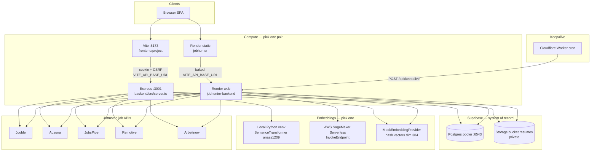
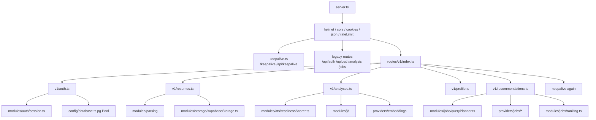
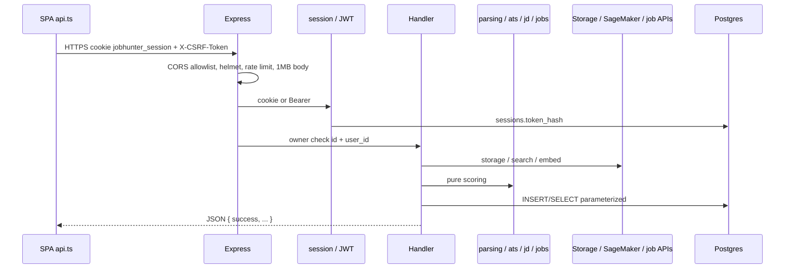

# JobHunter — system design and architecture

This document describes **how the system is built in this repository**, not a future roadmap. File paths are the source of truth. If this file disagrees with code, **believe the code**.

Companion: [README.md](./README.md) (reference) and [LOCAL_SETUP.md](./LOCAL_SETUP.md)
(how to run locally vs Render, plus the 2026-10-02 health-check snapshot).

---

## 1. Problem and product cut

JobHunter V2 is a resume-driven ATS + matching + recommendation product:

| Flow | User intent | ML? |
|---|---|---|
| Resume upload | Store PDF privately, parse text, build a skill/role profile | No |
| ATS readiness | Score the resume **without** a job description | **No** (pure rubric v3.0.0) |
| JD match | Score resume vs a pasted job description | Yes — one batched embedding call |
| Job recommendations | Search external job APIs, rank vs resume | Yes — one batched embedding call per run |

Cost rule encoded in the design: **if a request does not need vectors, stay on Render/Node; if it does, batch ≤32, dedupe, timeout generously, fall back to mock rather than 500.**

---

## 2. System context



**Trust boundary:** the browser never holds `SUPABASE_SERVICE_ROLE_KEY`, AWS keys, or job API keys. Only the Express process talks to Supabase, SageMaker, and job providers.

Local vs Render is **the same backend codebase**. Difference is env:

| | Local (intended) | Render (intended) |
|---|---|---|
| Frontend | Vite, `VITE_API_BASE_URL=http://localhost:3001/api/v1` | Static `dist`, `VITE_*` baked at build |
| API | `bun src/server.ts`, `PORT=3001` | `node dist/server.js`, `PORT=10000` |
| Embeddings | `EMBEDDING_PROVIDER=local` | `aws` or `auto` + `AWS_*` |
| Postgres / Storage | Same Supabase project | Same Supabase project |
| CORS | `http://localhost:5173` | `https://<frontend>.onrender.com` |

---

## 3. Logical architecture (modules)



| Layer | Path | Role |
|---|---|---|
| HTTP entry | `backend/src/server.ts` | Middleware, mounts, `/health`, fatal error handler, optional local-model warmup |
| Env | `backend/src/config/env.ts` | `zod`; DB URL priority `PG_DATABASE_STRING > DATABASE_URL > SUPABASE_DB_URL`; prod **exits** on invalid env; **dev continues** with insecure fallback JWT/DB if parse fails |
| Pool | `backend/src/config/database.ts` | `pg.Pool` + SSL; **connect() failure → process.exit(1)** even in development |
| Sessions | `backend/src/modules/auth/session.ts` | Opaque token, `sha256` stored, expiry, revoke |
| PDF | `backend/src/modules/parsing/{pdfParser,resumeProfile,skillNormalizer}.ts` | Bytes → text/sections → skills/seniority |
| Storage | `backend/src/modules/storage/supabaseStorage.ts` | Private bucket or `uploads/` fallback |
| ATS | `backend/src/modules/ats/readinessScorer.ts` | 8 categories = 100, version `3.0.0`, no network |
| JD | `backend/src/modules/jd/{jdParser,matcher}.ts` | Structure + strict skill equality (`Java ≠ JavaScript`) |
| Jobs | `backend/src/modules/jobs/{queryPlanner,ranking}.ts` | 3–4 queries; rank `30+25+15+15+10+5` |
| Job providers | `backend/src/providers/jobs/*` | Jooble, Adzuna, JobsPipe, Remotive, Arbeitnow + `jobStore` + budgets |
| Embeddings | `backend/src/providers/embeddings/*` | Interface + AWS / Local / Mock |
| Legacy services | `backend/src/services/*` | Older orchestration still used by `/api/*` |
| SPA | `frontend/project/src` | React 18 + Vite 5 + `src/lib/api.ts` |

---

## 4. Request lifecycle



**Auth:** opaque session first (`Session.verifySession`), JWT verify with `JWT_SECRET` as fallback (`authenticateAny` duplicated in several v1 files).

**CSRF:** `backend/src/middleware/csrf.ts` exists; v1 handlers do not all go through a global CSRF middleware in `server.ts` — Origin is constrained by CORS. Frontend still copies `csrfToken` / `XSRF-TOKEN` cookies onto `X-CSRF-Token`.

**IDOR:** list/get/delete/analyze/recommend load rows with `WHERE id=$1 AND user_id=$2` (or 403 if the id exists for another user).

---

## 5. Data flows

### 5.1 Upload → Storage → `resumes` row

1. `POST /api/v1/resumes` multipart field `resume` (+ `targetLevel`), `multer` memory, PDF MIME.
2. `parsePdfBuffer`: `%PDF` magic, pdfjs positional extract, fallbacks, page cap, scanned-PDF reject.
3. `uploadFile(userId, resumeId, buffer, filename)`:
   - `sha256`, sanitized name, path `userId/resumeId/safeName`
   - if `SUPABASE_URL` + `SUPABASE_SERVICE_ROLE_KEY` **and** `@supabase/supabase-js` loads → `storage.from(bucket).upload`
   - else or on error → disk `uploads/...` with `bucket: 'local'`
4. Insert `resumes` (storage refs, sha256, parser_version, `is_latest`, …).

Reads/deletes re-check ownership; delete removes object + row.

### 5.2 Readiness (no JD, no embeddings)

`POST /api/v1/analyses/readiness` → parse if needed → `buildResumeProfile` → `scoreReadiness` → persist `analyses` type `readiness`.

Rubric (weights must sum 100) in `readinessScorer.ts`: parseability 20, completeness 15, impact 20, experience quality 15, skills 10, writing 10, concision 5, hygiene 5, then strictness adjustments. Unit tests: `backend/src/tests/readiness.test.ts`.

### 5.3 JD match (embeddings)

`POST /api/v1/analyses/jd-match`:

1. Owner-checked resume + JD string (20–20000 chars).
2. Readiness + `parseJd` + `matchJd` (required 70% / preferred 30% of the **keyword** part).
3. Redacted chunks only (skills line, sliced experience, JD title/responsibilities/required skills). **No email/phone/PDF bytes** intended for the model.
4. One `provider.embed({ texts, purpose: 'jd' })`.
5. Per responsibility: best resume-chunk cosine → semantic component.
6. Compose `jdMatchScore` (explicit + semantic + role + domain + edu), persist `jd_hash`, `embedding_model_id`. Embed failure **degrades**, does not 500 the whole readiness payload.

Provider selection (`analyses.ts` / `ranking.ts`): `local` → `LocalEmbeddingProvider`; `mock` → mock; `aws` or SageMaker env → AWS; default `auto` → `AwsSageMakerEmbeddingProvider` (which itself mocks if AWS missing).

### 5.4 Recommendations

`POST /api/v1/recommendation-runs` (also mounted at `/api/v1/recommendations`):

1. Load resume + profile + optional body `targetRoles` / `locations` / …
2. `JobQueryPlanner.plan` → 3–4 focused queries (not `skills.join(' ')`).
3. Fan-out: **Jooble once per query**; Adzuna / JobsPipe / Remotive / Arbeitnow **once per run** on the primary query (`JOB_PROVIDERS`).
4. Cache `job_search_cache` (query hash, TTL; Arbeitnow longer). Budgets in `external_api_usage`.
5. Upsert `jobs` on `(source, external_id)`; dedupe URL/source/id then title|company.
6. `rankJobsBatch`: **one** embed over unique texts; scores 30 skill + 25 semantic + 15 role + 15 seniority + 10 domain/edu + 5 location.
7. Persist `recommendation_runs` + top 20 `recommendations`.

Missing keys / quota / empty HTTP → provider `fallbackFromDb` / skip. Ranker still runs on whatever was fetched.

### 5.5 Keepalive

Public INSERT into `keepalive_pings` (migration `005`). Cloudflare Worker every 12h hits Render `/api/keepalive` so **Supabase free-tier 7-day pause** is reset. If the Render API cannot wake, keepalive **cannot** save the DB — that is the failure mode observed 2026-10-01.

---

## 6. Embeddings design

Contract (`EmbeddingProvider.ts`):

```text
embed({ texts, purpose: 'resume'|'job'|'jd' })
  → { vectors: number[][], modelId, dimension }
```

| Implementation | When | Mechanism |
|---|---|---|
| `LocalEmbeddingProvider` | `EMBEDDING_PROVIDER=local` | For `anass1209/*`, spawn venv Python `SentenceTransformer.encode`; else `@xenova/transformers` ONNX (optional npm, **not** currently in `package.json`) |
| `AwsSageMakerEmbeddingProvider` | `aws` / `auto` + AWS env | `InvokeEndpoint` JSON `{ inputs, purpose }`; accept `embeddings` or `vectors`; batch 32; truncate 5k chars |
| `MockEmbeddingProvider` | `mock`, tests, **every** failure path | Deterministic hash, dim 384, `modelId` like `mock-384` so callers can log `usedMock` |

Local warmup: `server.ts` after listen, only if provider is `local`. First Python load ~60–90s; timeout 260s per batch.

**Python Flask (`backend/python/app.py`) is not on the V2 hot path.** Keeping it running on `:5000` does nothing unless something still sets `PYTHON_SERVICE_URL` and a **legacy** service consumes it.

---

## 7. Storage design

```text
Client  →  Express (auth + PDF checks)
        →  supabaseStorage.uploadFile
        →  Supabase Storage  resumes/<userId>/<resumeId>/<file>
        →  resumes.storage_bucket / storage_object_path / sha256
```

Bucket is private. Downloads go through the API (`GET /resumes/:id/download`), not public URLs.

If the JS client cannot be imported, `getSupabaseClient()` returns `null` and uploads go to disk even when env vars are set. `@supabase/supabase-js` must be a real dependency (added 2026-10-01).

---

## 8. Database

Migrations: `backend/migrations/001_initial_v2.sql` … `005_keepalive.sql`, applied by `npm run migrate` → `src/db/migrations/run_migration.ts` (there is also `src/db/migrate.ts` — do not assume they are identical without reading both).

| Area | Tables |
|---|---|
| Identity | `users`, `sessions` (`token_hash`, `expires_at`, `revoked_at`) |
| Resume | `resumes`, `resume_profiles` |
| Scoring | `analyses` |
| Jobs | `jobs`, `job_embeddings`, `resume_embeddings`, `job_search_cache` |
| Recs | `user_job_preferences`, `recommendation_runs`, `recommendations`, `job_applications` |
| Ops | `external_api_usage`, `keepalive_pings` |
| Search | `jobs.search_vector` GIN (`002`) |

FKs `ON DELETE CASCADE`. Queries parameterized. Pooler (6543) needs `?pgbouncer=true` or you will hit prepared-statement errors **when the tenant exists**. Tenant-not-found means the **project** is gone/paused, not pgbouncer.

---

## 9. Frontend architecture

- Router: `frontend/project/src/app/router.tsx`
- Public: `/`, `/login`, `/signup`, `/privacy`, `/terms`
- Authed `/app/*`: `ats`, `analysis/:id`, `jobs`, `resumes`, `profile`
- `SessionGuard` calls `GET /auth/session` (relative to `VITE_API_BASE_URL`)
- Axios: `withCredentials: true`, 60s default, longer timeouts on ML routes in call sites
- `VITE_*` are **compile-time**. Changing Render env without rebuild leaves the old API host in the JS bundle.

Default in `api.ts` if env missing: `http://localhost:3001/api` (**not** `/api/v1`). Local `.env` must set `/api/v1` or v1 paths break.

---

## 10. Deployment architecture

`render.yaml`:

- **jobhunter-backend**: Node 20.11.0, `rootDir: backend`, build `npm ci --include=dev && npm run build`, start `node dist/server.js`, health `/health`, `branch: dev`, plan free, secrets `sync: false`
- **jobhunter**: static, `rootDir: frontend/project`, publish `dist`, SPA rewrite `/* → /index.html`

Free Render **hibernates**. Wake requires a successful `node dist/server.js`. Because `database.ts` exits on connect failure, a dead Supabase project makes wake **impossible** (`x-render-routing: hibernate-wake-error`).

CI: `.github/workflows/ci.yml` — frontend lint/tsc/build, backend tsc/test/build, advisory audit + gitleaks.

---

## 11. Security model (short)

Full write-up: [SECURITY.md](./SECURITY.md).

- HttpOnly session cookie + optional Bearer JWT
- bcrypt on passwords (signup/login)
- helmet, CORS allowlist (empty list currently means `origin: true` in `server.ts` — looser than the README’s “strict” wording)
- rate limits on `/api/auth` and uploads
- PDF-only upload, sanitized paths, server-side sha256
- service_role never shipped to the SPA
- SageMaker IAM should be `sagemaker:InvokeEndpoint` on one endpoint ARN only (`infra/aws/README.md`)

---

## 12. Failure modes and fallbacks

| Failure | Behavior |
|---|---|
| No / bad Postgres | **Process exits** — nothing, including `/health`, stays up |
| No Storage client or upload error | Local `uploads/` + warning |
| No AWS / SageMaker error | Mock 384-d vectors, truthful mock `modelId` |
| Local Python embed fail | Try Xenova ONNX; else mock |
| Job API 4xx/timeout/no key | DB ILIKE / cache fallback |
| Scanned PDF | 400 `SCANNED_PDF` |
| Cross-user resume id | 403 |
| Render idle | Hibernate; first request should wake **if** boot succeeds |
| Supabase 7-day pause | Keepalive INSERT; useless if API cannot boot |

---

## 13. API surface (authoritative)

See README §3 for the path catalog. Source files:

- `backend/src/server.ts`
- `backend/src/routes/v1/*.ts`
- `backend/src/routes/{auth,upload,analysis,jobs,keepalive}.ts`

**Quirk:** `v1/index.ts` mounts `profile` at both `/profile` and `/job-preferences`, and `profile.ts` also defines `/job-preferences` routes. That yields both `/api/v1/job-preferences` and `/api/v1/profile/job-preferences`. Prefer the paths the SPA actually calls (`frontend/project/src`).

---

## 14. What is *not* the architecture (stale docs)

These appear in older markdown / Python README and should not drive implementation:

- “Must run Flask on `:5000` for V2 embeddings”
- “Only Jooble exists” — five providers are in `providers/jobs/`
- “Supabase JS is optional peer that always works” — it must be installed
- “Render health 200 means the whole stack is up” — frontend can be 200 while API is 503
- Boot log “Database: Not configured” as a real signal — it ignores `PG_DATABASE_STRING`

---

## 15. Operational restore order (unchanged — see §16 for the 2026-10-02 sweep)

1. Recreate or unpause Supabase; confirm `https://<ref>.supabase.co` **resolves**.
2. Put pooler URI with `?pgbouncer=true` in local `.env` **and** Render.
3. `cd backend && npm run migrate`.
4. Confirm `npm run dev` prints Postgres connected and `/health` 200.
5. Hit `/api/keepalive` once; check `keepalive_pings`.
6. Upload a PDF; confirm Storage object, not only `uploads/`.
7. Redeploy Render backend; `curl -sSI` `/health` until **200**, not `hibernate-wake-error`.
8. If frontend API host changed, rebuild Render static site.

---

## 16. 2026-10-02 verification sweep (what changed since §1–15)

Full local + Render health sweep with a real resume, all green except one
packaging gap (fixed below). Per-route evidence in `LOCAL_SETUP.md` §6.

- **Retrieval is junior-aware now.** `queryPlanner.plan` excludes academic noise
  (DSA/DBMS/OOP) as search terms and emits `Junior <role>` + `Fresher <skill>`
  queries for junior profiles. `JobsPipeProvider` sends `job_seniority_or`
  for juniors. Verified: Jooble still returns senior-heavy pools (its keyword
  match ignores qualifiers), so ranking demotes instead.
- **Ranking discriminates seniority.** `detectJobSeniority` handles II/III/IV,
  Sr./Jr., L3–L6, `N+ years`, `1+ years`→junior, bare `Associate Engineer`→
  junior; penalties steepened (adjacent 8, gap-2 → 3, gap-3 → 0); junior vs
  senior/lead hard-capped at 65 total. `to01` cosine stretch `[0.35,0.95]→[0,1]`
  + best-resume-chunk semantics. Thin snippets (≤2 skills) score neutral 15.
  Location: India-city containment + remote-anywhere. Runs return
  `matchedSkills/missingSkills` (the Jobs UI boxes were empty without them).
- **Timeouts unified at 260s:** SageMaker `InvokeEndpoint`, local venv spawn,
  and frontend ML routes (`jd-match`, `recommendation-runs`). Global axios
  default stays 60s.
- **Breakdown display bug (fixed):** `JobsPage` treated point values ≤1 as
  0–1 fractions (`roleTitle = 1` rendered as **100**). Now renders `value/max`
  via `BREAKDOWN_MAX`. If a bar ever shows an impossible number, suspect the
  formatter, not the scorer.
- **Storage gap found and fixed:** `@supabase/supabase-js` was imported by
  `supabaseStorage.ts` but missing from `package.json` — Render (`npm ci`
  from lock) silently fell back to **ephemeral disk**, so Render uploads never
  reached the bucket (bucket listing proved it: local user folder present,
  Render user folder absent). Committed the dep; the next Render deploy is
  what actually moves Render uploads into Supabase. Re-verify post-deploy by
  uploading on Render and listing the bucket prefix.
- **Legacy localStorage JWT survives** (`AuthForm`/`Home`/`App.legacy`) next
  to v1 HttpOnly cookies — see README §9.
- Local vs Render parity on identical inputs: readiness **58 = 58**, jd-match
  **60 = 60** (Medium, real embeddings both sides), recommendations top =
  intern/entry roles both sides.

## 17. 2026-10-02/03 audit follow-up (PLAN.md)

Second-pass audit of §1–16 against the running code. Fixed on `dev`
(commits `2532a45`…`8e4b127`, not pushed):

- **Issue 2 — resume deep links.** `GET /analyses?resumeId&latest` filters;
  new `/app/resumes/:id` route (report if analyzed, card + Analyze CTA if
  not); AtsPage `?resumeId` reuses the stored PDF (no re-upload); unknown ids
  → "Resume not found", unknown analysis → contextual copy (was bare
  "Analysis not found").
- **Issue 3 — login gate.** Session GET capped at 8 s with single-flight
  refresh; `PublicOnly` paints the form before the session resolves;
  `SessionGuard` trusts `/auth/session` only (legacy `/latest-resume` fallback
  dropped — S7); Google Fonts `@import` (render-blocking) replaced with
  `<link rel=preconnect>` + `display=swap`.
- **Issue 4 — deps.** Backend audit clean (0 vulns); frontend 11 → 4
  (remaining = majors `esbuild`/`react-router-dom`/`vite`, deferred).
- **Secondary:** PDF parsed once per upload (S3); startup banner reports the
  `getDatabaseUrl()` source instead of always checking `DATABASE_URL` (S8);
  dead relative-path `fs.existsSync` fallback removed — missing stored files
  now return **410** with a re-upload message instead of a 500 (S4 + lost-file
  UX of S1).
- **Gates:** backend 23/23 tests; frontend `tsc --noEmit` + build; scripted
  browser E2E 18/18 (resume view) + 2/2 (login gate), all `qa.*@example.com`
  users deleted after runs.

**Open:** Issue 1 (prod uploads — confirm Render `SUPABASE_URL`/service key,
redeploy, re-probe), S1 backfill for irrecoverable rows, S2 orphan sweep
(needs user go-ahead), frontend major bumps (`react-router-dom@7`, `vite@8`).
